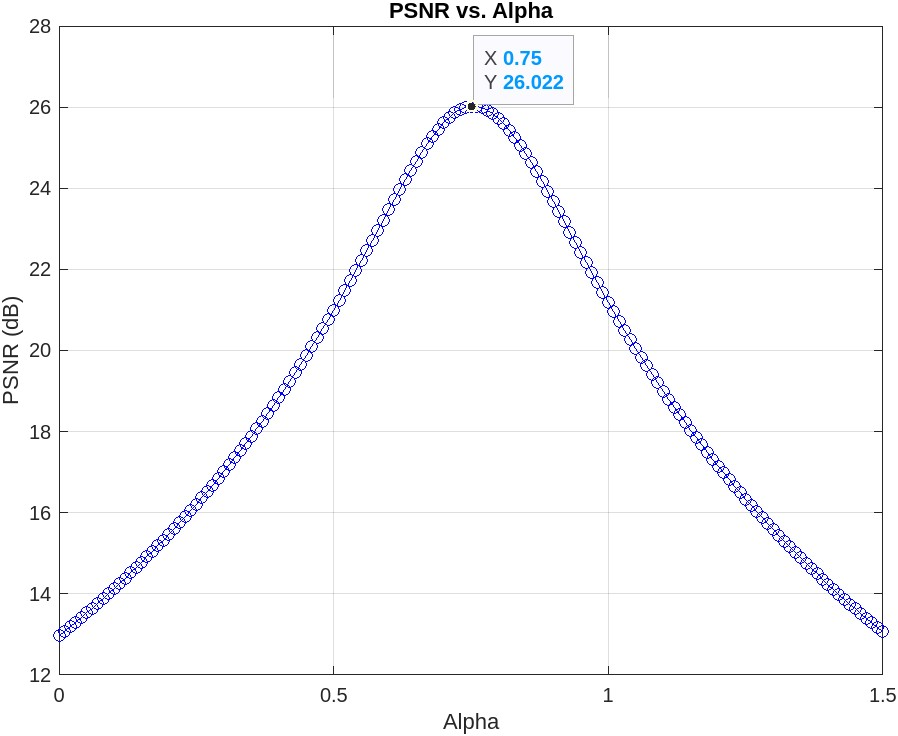
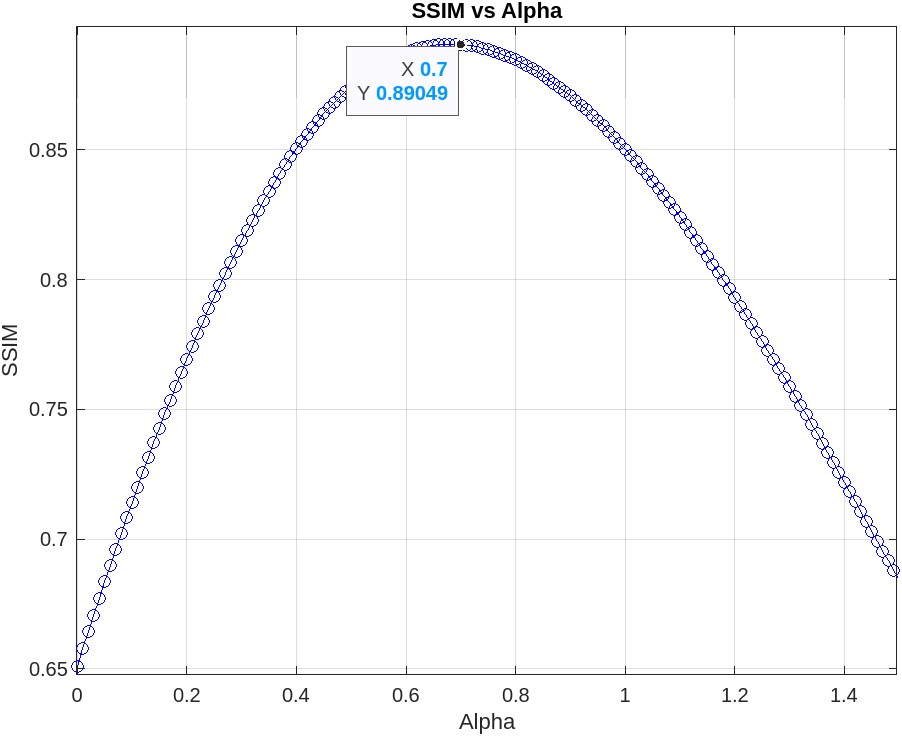

# Low Contrast Image Enhancement

### Enhancing Image Contrast: A Novel Approach using Modified Transfer Function and Energy Curve Equalization

## Overview

**NOTE:**
- The block diagram of proposed method is shown in above diagram.
- **Proposed_Method.m** is MATLAB code for our algorithm.
- **Image1.jpg** is sample image taken from our dataset as input.

## Datasets
- We have taken three datasets for testing our proposed algorithm.
- Three Datasets : 200 images from our dataset of athletes, 100 Images from Berkeley BSDS dataset, 30 images from the CEED2016 dataset.
- Below are the samples of images from our dataset **IIT Patna Sports-2023** .

**Samples of Our Dataset IIT Patna Sports-2023**
| Datasets | No. of images taken |
|-------|:---------:|
|IIT Patna Sports-2023 (Ours) |   200    |
| Berkeley BSDS |   100    | 
| CEED2016 |   30    |

## Results
**Qualitative Analysis**
- Visualization of input and enhanced output images from IIT Patna Sports-2023, BSDS, and CEED2016 datasets are shown below.
- Column from top to bottom specifies the low contrast input image, images with JHE, RDWTF, LumiNet, ECE with TF and proposed ECE with modified TF (ours).

**Quantitative Analysis**

Note : Table to be updated soon

**Results produced by** Input image **Image1.jpg** in the block diagram.

  

## Environment
- MATLAB R2023a **(Recommend **NOT** to use very old versions of MATLAB.)**

